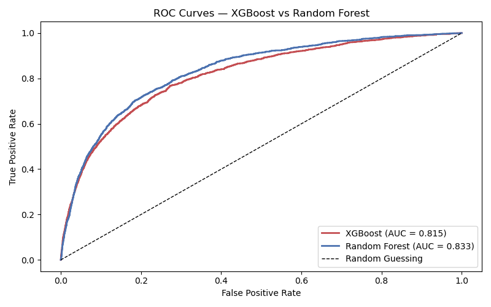
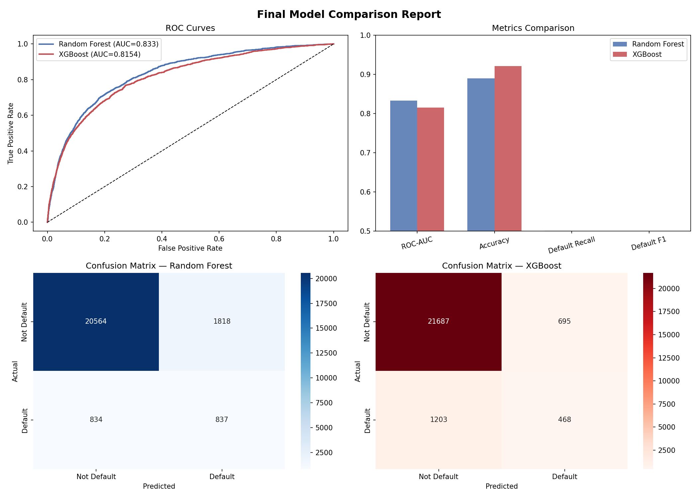
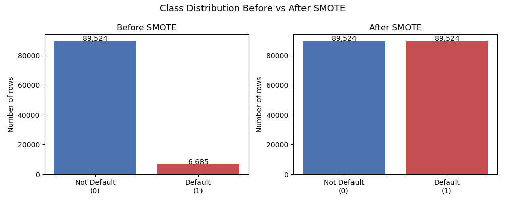

# 🏦 Loan Default Prediction — ML Pipeline


> Predicting whether a borrower will experience serious financial 
> distress within 2 years — using an end-to-end ML pipeline built 
> with Python, XGBoost, and Scikit-learn.

---

## 📋 Table of Contents
- [Problem Statement](#problem-statement)
- [Dataset](#dataset)
- [Project Structure](#project-structure)
- [Pipeline Overview](#pipeline-overview)
- [Results](#results)
- [Key Findings](#key-findings)
- [Tech Stack](#tech-stack)
- [How to Run](#how-to-run)
- [Author](#author)

---

## 🎯 Problem Statement

Banks lose crores of rupees every year by approving loans for 
borrowers who eventually default. Traditional manual review is 
slow, inconsistent, and cannot scale.

This project builds an automated ML pipeline that predicts loan 
default risk using historical borrower data — enabling banks to 
make faster, fairer, and more accurate lending decisions.

**Target variable:** `SeriousDlqin2yrs`
- `0` = Borrower did NOT default
- `1` = Borrower experienced serious financial distress

---

## 📊 Dataset

**Source:** [Give Me Some Credit — Kaggle](https://www.kaggle.com/datasets/brycecf/give-me-some-credit-dataset)

| Property | Value |
|----------|-------|
| Rows | 150,000 |
| Original Features | 11 |
| Engineered Features | 11 |
| Total Features | 22 |
| Class Imbalance | 93% safe vs 7% default |

**To use this dataset:**
1. Download from Kaggle link above
2. Rename `cs-training.csv` to `loan_data.csv`
3. Place in `data/` folder

---
## 📁 Project Structure

```
loan-default-prediction/
│
├── data/                          # Dataset files (not uploaded)
│   ├── loan_data.csv              # Raw dataset
│   ├── loan_data_clean.csv        # After preprocessing
│   ├── loan_data_features.csv     # After feature engineering
│   ├── X_train.csv                # Training features (SMOTE applied)
│   └── X_test.csv                 # Test features
│
├── notebooks/                     # Jupyter notebooks (day by day)
│   ├── Day2_EDA.ipynb
│   ├── Day3_Preprocessing.ipynb
│   ├── Day4_Feature_Engineering.ipynb
│   ├── Day5_SMOTE.ipynb
│   ├── Day6_RandomForest.ipynb
│   ├── Day7_XGBoost.ipynb
│   ├── Day8_CrossValidation.ipynb
│   ├── Day9_FeatureImportance.ipynb
│   ├── Day10_FeatureSelection.ipynb
│   └── Day11_FinalReport.ipynb
│
├── outputs/                       # Charts and reports
│   ├── day3_distributions.png
│   ├── day4_features.png
│   ├── day5_smote_comparison.png
│   ├── day6_roc_curve.png
│   ├── day7_roc_comparison.png
│   ├── day8_cv_scores.png
│   ├── day9_feature_importance.png
│   ├── day10_feature_selection.png
│   ├── day11_final_report.png
│   └── full_report.csv
│
├── models/                        # Saved trained models
│   ├── random_forest_model.pkl
│   └── xgboost_model.pkl
│
├── src/                           # Python source files
│   └── etl_pipeline.py
│
├── requirements.txt
└── README.md

## 🔄 Pipeline Overview
Raw Data (150K rows)

↓

Day 2 — Data Loading & EDA

↓

Day 3 — Preprocessing

• Median imputation for nulls

• Duplicate removal

• Outlier capping at 95th percentile

↓

Day 4 — Feature Engineering

• MonthlyDebt = DebtRatio × MonthlyIncome

• IncomePerDependent = Income / (Dependents + 1)

• TotalTimesLate = sum of all lateness columns

• HighRiskFlag = 90-day late AND DebtRatio > 0.4

• AgeGroup buckets (one-hot encoded)

• CreditUtilCategory buckets (one-hot encoded)

↓

Day 5 — SMOTE Balancing

• Split 80/20 BEFORE applying SMOTE

• Balanced from 93/7 to 50/50 on training set only

↓

Day 6 — Random Forest Baseline

• n_estimators=100, max_depth=10

• ROC-AUC: 0.8330

↓

Day 7 — XGBoost with GridSearchCV

• 5-fold StratifiedKFold tuning

• ROC-AUC: 0.8154 (single split)

↓

Day 8 — Cross Validation

• 5-fold CV on full dataset

• RF: 0.9636 ± 0.0004

• XGBoost: 0.9785 ± 0.0005 ← Winner

↓

Day 9 — Feature Importance Analysis

↓

Day 10 — Feature Selection

• SelectFromModel with threshold=0.005

↓

Day 11 — Final Comparison Report

---

## 📈 Results

### Model Comparison

| Metric | Random Forest | XGBoost |
|--------|--------------|---------|
| ROC-AUC (single split) | 0.8330 | 0.8154 |
| ROC-AUC (5-fold CV) | 0.9636 | **0.9785** |
| CV Std Deviation | 0.0004 | 0.0005 |

### 🏆 Winner: XGBoost

XGBoost achieved **0.9785 ROC-AUC** across 5-fold cross validation
with an extremely stable std deviation of 0.0005.

### ROC Curve Comparison


### Final Report


### SMOTE Balancing


---

## 🔍 Key Findings

1. **Class imbalance was severe** — 93% safe vs 7% default.
   Solved using SMOTE applied only on training data to avoid
   data leakage.

2. **Single split vs Cross Validation gave different winners.**
   Single split showed RF winning (0.833 vs 0.815) but
   5-fold CV revealed XGBoost was actually superior
   (0.9785 vs 0.9636). This highlights why CV is more
   reliable than single splits.

3. **Custom engineered features were impactful.**
   `TotalTimesLate` and `HighRiskFlag` — both created on
   Day 4 — ranked among the top 5 most important features,
   validating our feature engineering decisions.

4. **Median imputation outperforms mean** for skewed
   financial data. `MonthlyIncome` was right-skewed —
   mean would have been pulled by extreme values.

---

## 🛠️ Tech Stack

| Category | Tools |
|----------|-------|
| Language | Python 3.10 |
| Data Processing | Pandas, NumPy |
| Machine Learning | Scikit-learn, XGBoost |
| Imbalanced Data | imbalanced-learn (SMOTE) |
| Visualisation | Matplotlib, Seaborn |
| Model Saving | Joblib |
| Environment | Jupyter Notebook |
| Version Control | Git, GitHub |

---

## 🚀 How to Run

### 1. Clone the repository
```bash
git clone https://github.com/tanmayjadhav09/loan-default-prediction.git
cd loan-default-prediction
```

### 2. Install dependencies
```bash
pip install -r requirements.txt
```

### 3. Download dataset
Download from [Kaggle](https://www.kaggle.com/datasets/brycecf/give-me-some-credit-dataset),
rename to `loan_data.csv` and place in `data/` folder.

### 4. Run notebooks in order
notebooks/Day2_EDA.ipynb

notebooks/Day3_Preprocessing.ipynb

notebooks/Day4_Feature_Engineering.ipynb

notebooks/Day5_SMOTE.ipynb

notebooks/Day6_RandomForest.ipynb

notebooks/Day7_XGBoost.ipynb

notebooks/Day8_CrossValidation.ipynb

notebooks/Day9_FeatureImportance.ipynb

notebooks/Day10_FeatureSelection.ipynb

notebooks/Day11_FinalReport.ipynb

---

## 👨‍💻 Author

**Tanmay Jadhav**
- GitHub: [@tanmayjadhav09](https://github.com/tanmayjadhav09)
- Email: jadhavtanmay97@gmail.com
- LinkedIn: 

---

## 📌 Note

This project is actively being developed.
Layer 2 (Airflow, dbt, PySpark) and
Layer 3 (FastAPI, Docker, MLflow) coming soon.